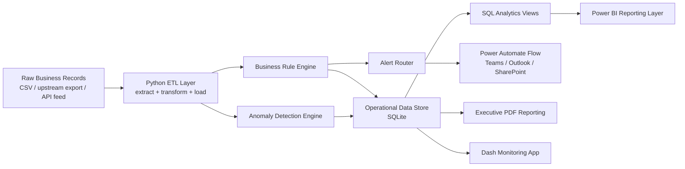

# FlowSentinel

**FlowSentinel: Intelligent Business Process Automation, Monitoring, and Operational Analytics Platform**

[](https://www.python.org/)
[](./sql)
[](./powerbi)
[](./power_automate)
[](./.github/workflows/daily_pipeline.yml)
[](./LICENSE)

FlowSentinel is a portfolio-grade operations intelligence project that simulates how a modern business process control tower can monitor high-volume workflows in near real time. It combines **Python ETL**, **SQL analytics modeling**, **Power BI reporting assets**, and **Power Automate-style alert orchestration** into one cohesive project that is easy to demo, easy to extend, and strong enough to showcase on GitHub, LinkedIn, or a resume.

The system is designed around a realistic operations use case:

- Process `50,000+` daily business records through an automated pipeline.
- Validate records against business controls and process-quality rules.
- Detect anomalies using statistical and machine learning methods.
- Compute a daily operational health score for leadership.
- Route flagged exceptions to the right teams.
- Export curated datasets for Power BI reporting.
- Generate executive-ready PDF summaries without manual work.

## Why this project stands out

This repo is intentionally built to look and feel like a professional analytics engineering and automation project rather than just a Python script collection.

- Clear separation between ingestion, validation, scoring, reporting, and automation layers.
- Real SQL artifacts for schema design and analytics views.
- Microsoft ecosystem integration artifacts for Power BI and Power Automate.
- Daily scheduled workflow through GitHub Actions.
- Synthetic sample-data generator so the project works immediately after cloning.
- Test coverage for key logic and pipeline smoke validation.

## Tech stack

| Area | Tools |
|---|---|
| Data pipeline | Python, Pandas |
| Anomaly detection | Scikit-learn, Isolation Forest, z-score logic |
| Persistence | SQLite |
| Analytics modeling | SQL views |
| Dashboarding | Dash, Plotly |
| Reporting | ReportLab |
| Workflow automation | GitHub Actions, Power Automate reference flow |
| BI integration | Power BI DAX and Power Query |

## Business scenario

Imagine an operations team responsible for monitoring a high-volume daily process such as order handling, invoice processing, logistics updates, or internal service transactions. Manual reporting and reactive issue handling often lead to:

- delayed visibility into failures,
- inconsistent exception handling,
- fragmented team ownership,
- weak auditability,
- and leadership dashboards that are always behind.

FlowSentinel addresses that by creating an automated monitoring layer that continuously evaluates process health and produces the exact operational outputs leadership and cross-functional teams need.

## Core capabilities

### 1. Automated ETL pipeline

The Python pipeline reads raw source records, validates structure, cleans fields, standardizes types, enriches data, and stores processed outputs in SQLite.

### 2. Rule-based validation engine

Records are evaluated against configurable business rules such as:

- positive transaction amounts,
- valid lifecycle statuses,
- non-negative quantities,
- acceptable processing-time thresholds,
- valid departments,
- and required record identifiers.

### 3. Anomaly detection

FlowSentinel uses a dual approach:

- **Isolation Forest** for multivariate anomaly detection.
- **Z-score flagging** for field-level outlier detection.

This creates a more realistic monitoring story than using only static rules.

### 4. Process health scoring

Each run produces a composite `0-100` health score using weighted KPIs:

- completeness,
- error-free rate,
- throughput,
- anomaly-free rate.

This turns pipeline output into a leadership-ready operating metric instead of just a list of errors.

### 5. Automated exception routing

Flagged records can be routed by team and severity through webhook payloads that map directly into Power Automate flows for downstream actioning in Microsoft Teams, Outlook, SharePoint, or Dataverse.

### 6. Executive reporting

The project can automatically generate:

- PDF health reports,
- dashboard-friendly CSV exports,
- and Power BI-ready modeled datasets.

## Architecture



## Repository structure

```text
flow-sentinel-/
├── .github/workflows/
│   └── daily_pipeline.yml
├── data/
│   ├── processed/
│   └── raw/
├── outputs/
├── power_automate/
│   ├── README.md
│   └── exception_alert_flow.json
├── powerbi/
│   ├── README.md
│   ├── flowsentinel_measures.dax
│   └── flowsentinel_transform.m
├── sql/
│   ├── analytics_views.sql
│   └── schema.sql
├── src/flowsentinel/
│   ├── alerts/
│   ├── dashboard/
│   ├── etl/
│   ├── reports/
│   ├── sample_data/
│   ├── scoring/
│   ├── validation/
│   ├── config.py
│   └── pipeline.py
├── tests/
├── .env.example
├── .gitignore
├── requirements.txt
├── run_pipeline.py
└── README.md
```

## Getting started

### Prerequisites

- Python `3.9+`
- `pip`
- Git

### 1. Clone the repository

```bash
git clone https://github.com/Osie2x/flow-sentinel-.git
cd flow-sentinel-
```

### 2. Create and activate a virtual environment

```bash
python -m venv .venv
source .venv/bin/activate
```

### 3. Install dependencies

```bash
pip install -r requirements.txt
```

### 4. Set your Python path

```bash
export PYTHONPATH=src
```

### 5. Generate demo data

```bash
python -m flowsentinel.sample_data.generate_sample_data --records 50000
```

### 6. Run the pipeline

```bash
python run_pipeline.py
```

### 7. Launch the dashboard

```bash
python -m flowsentinel.dashboard.app
```

Open `http://localhost:8050`.

## Quick demo workflow

If you want to show this project quickly in an interview or portfolio walkthrough:

1. Generate `50,000` sample records.
2. Run the pipeline.
3. Show the exported CSVs in `data/processed/`.
4. Open the Dash dashboard.
5. Walk through the SQL views in `sql/`.
6. Show the Power BI DAX and Power Query assets.
7. Explain how the webhook output maps into the Power Automate flow template.

## Pipeline outputs

After a successful run, FlowSentinel produces:

- `data/flowsentinel.db`: operational SQLite database
- `data/processed/records.csv`: processed record export
- `data/processed/exceptions.csv`: exception export
- `data/processed/anomalies.csv`: anomaly export
- `data/processed/health_scores.csv`: historical process health scores
- `data/processed/daily_health_summary.csv`: Power BI-ready summary table
- `data/processed/team_exception_summary.csv`: team-level exception mart
- `outputs/*.pdf`: executive report artifacts when PDF generation is enabled

## SQL analytics layer

The SQL layer gives this project a stronger data-platform feel and makes it much easier to explain the analytics design in interviews.

### Key files

- [`sql/schema.sql`](./sql/schema.sql)
- [`sql/analytics_views.sql`](./sql/analytics_views.sql)

### Included analytics views

- `daily_health_summary`
- `team_exception_summary`
- `hourly_process_kpis`

These views make it easier to connect BI tooling without forcing report authors to work directly from raw operational tables.

## Power BI layer

The `powerbi/` folder contains reusable artifacts for a Microsoft BI workflow.

### Included assets

- `flowsentinel_measures.dax`: KPI measures for leadership dashboards
- `flowsentinel_transform.m`: Power Query transformation script
- `powerbi/README.md`: setup guidance for dashboard design

### Suggested dashboard pages

1. Executive Overview
2. Daily Process Health
3. Exceptions by Team and Severity
4. Operational Throughput and Processing Time
5. Compliance and Rule Failures

## Power Automate layer

The `power_automate/` folder contains a reference flow definition for how exception payloads can be operationalized in Microsoft tooling.

### Example downstream actions

- Teams message posting
- Outlook notifications
- SharePoint audit logging
- Dataverse integration
- Planner task creation

This gives the repository a much stronger end-to-end automation story than a standalone Python pipeline.

## Configuration

Configuration lives primarily in:

- `src/flowsentinel/config.py`
- `.env.example`

You can customize:

- source-file paths,
- database paths,
- alert endpoints,
- expected daily volume,
- anomaly thresholds,
- dashboard refresh behavior,
- PDF reporting settings.

## Running tests

```bash
export PYTHONPATH=src
pytest -v
```

## Automation

The scheduled workflow lives in:

- `.github/workflows/daily_pipeline.yml`

It demonstrates how the repo can be run automatically on a daily cadence to:

- generate demo data,
- execute the pipeline,
- run tests,
- upload reporting artifacts.

## How to extend this project

Some strong next steps if you want to keep growing this repository:

- swap SQLite for PostgreSQL,
- ingest from an API or message queue,
- add dbt models for a richer analytics layer,
- connect to a real Power BI `.pbix`,
- replace demo webhooks with real Power Automate endpoints,
- add Docker support,
- deploy the dashboard,
- add historical benchmarking and SLA tracking.

## Resume-ready project summary

You can adapt this directly:

> Built FlowSentinel, an intelligent business process automation and monitoring platform that processes 50,000+ daily records through a Python ETL workflow with rule-based validation, anomaly detection, SQL analytics modeling, automated PDF reporting, Power Automate alert routing, and Power BI-ready executive reporting assets.

## Why this repo is portfolio-friendly

Many portfolio projects show only one layer of the stack. This repository is stronger because it demonstrates:

- software engineering,
- analytics engineering,
- business intelligence thinking,
- operations monitoring,
- automation design,
- and stakeholder-facing reporting.

That combination makes it especially strong for roles across:

- data analytics,
- business intelligence,
- analytics engineering,
- operations analytics,
- automation engineering,
- and business systems roles.

## Contributing

Contributions, improvements, and extensions are welcome. See [CONTRIBUTING.md](./CONTRIBUTING.md) for a simple development workflow.

## License

This project is released under the [MIT License](./LICENSE).
